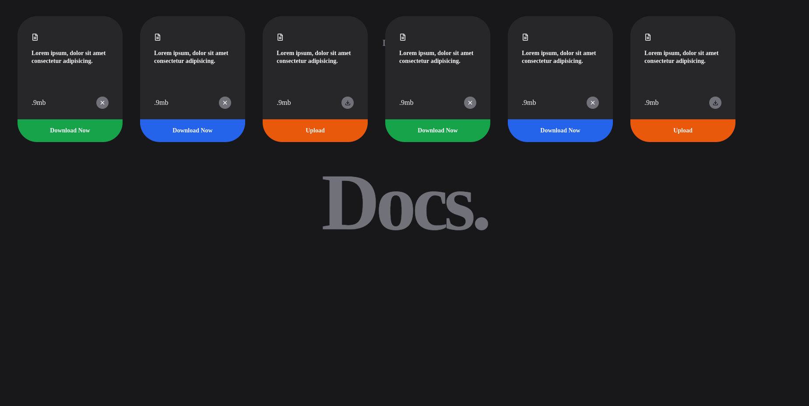

# Docs App

Welcome to the Docs app, a sleek document listing application built using React, Tailwind CSS, Framer Motion, and powered by Vite.



## Overview

The Docs app is designed to display a list of documents in visually appealing cards. The application utilizes various React concepts such as dynamic rendering, refs, conditional rendering, fragments, and leverages the Framer Motion library for animations to create a smooth and interactive user experience. Tailwind CSS is employed for styling, incorporating flexbox, position-related styling, and a vibrant color palette from Tailwind. Vite, a fast and efficient build tool for modern web development, is used to set up and scaffold the React app.

## Technologies Used

- React
- Tailwind CSS
- Framer Motion
- Vite

## React Concepts

### 1. Dynamic Rendering

Dynamic rendering in React involves dynamically generating and updating the user interface based on data or certain conditions. In the Docs app, dynamic rendering is used to create and update the list of document cards based on the provided data.

### 2. Refs

Refs in React are used to reference a React element or a class component instance. They provide a way to interact with the DOM directly or to access the methods and properties of a class component. In the Docs app, refs may be used to access and manipulate specific elements, enhancing interactivity or animation.

### 3. Conditional Rendering

Conditional rendering in React allows you to render different components or content based on certain conditions. It's often used to create dynamic and responsive user interfaces. In the Docs app, conditional rendering might be applied to show or hide certain elements or components based on the state of the application.

### 4. Fragments

Fragments in React are used to group multiple children elements without introducing an additional parent div to the DOM. They provide a cleaner way to structure components, especially when you don't want to add unnecessary nodes to the rendered output. In the Docs app, fragments might be used to wrap groups of elements within components without impacting the DOM structure.

### 5. Framer Motion for Animation

Framer Motion is a popular animation library for React. It simplifies the process of adding animations to React components, providing a declarative syntax for defining animations. In the Docs app, Framer Motion is used to create smooth and engaging animations for the document cards, enhancing the overall user experience.

## Components

### 1. Background Component

The background component sets the stage for the app, providing a visually pleasing backdrop to enhance the overall user interface.

### 2. Foreground Component

The foreground component acts as the main container, housing the dynamic rendering of document cards and incorporating the use of refs, conditional rendering, and fragments for optimal performance.

### 3. Card Component

The card component is responsible for rendering individual document cards. Framer Motion is employed to introduce smooth animations, making the user interaction more engaging.

## Getting Started

To run the Docs app locally, follow these steps:

1. Clone the repository:

   ```bash
   git clone https://github.com/your-username/docs-app.git
   ```

2. Navigate to the project directory:

   ```bash
   cd docs-app
   ```

3. Install dependencies:

   ```bash
   npm install
   ```

4. Run the app:

   ```bash
   npm run dev
   ```

5. Open your browser and go to [http://localhost:5173/](http://localhost:5173/) to view the app.

## Dependencies

- React: [https://reactjs.org/](https://reactjs.org/)
- Tailwind CSS: [https://tailwindcss.com/](https://tailwindcss.com/)
- Framer Motion: [https://www.framer.com/motion/](https://www.framer.com/motion/)
- Vite: [https://vitejs.dev/](https://vitejs.dev/)


## Credits

This project is built with inspiration from [Sheryians](https://www.sheryians.com/). Thanks to their resources and guidance!


Thank you for using the Docs app!
